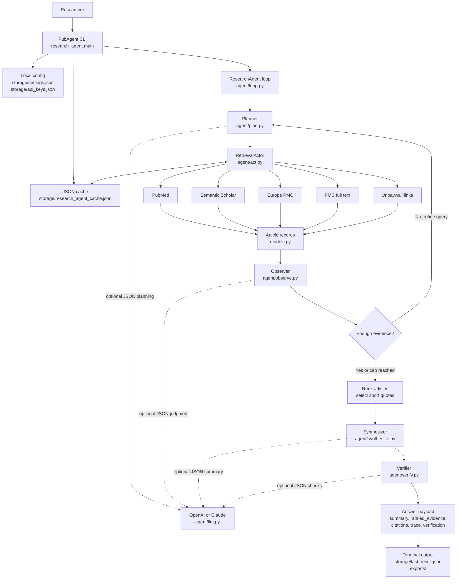

# PubAgent - grounded literature retrieval, zero fabricated citations

PubAgent is a standalone, live literature-search assistant for researchers who need citable evidence. It runs an agent loop:

```text
PLAN -> ACT -> OBSERVE -> DECIDE -> SYNTHESIZE -> VERIFY -> ANSWER
```

It is not a persistent local RAG system and does not build a vector database. It searches public scholarly APIs, ranks retrieved articles, extracts short exact quotations, and returns a concise summary plus quote-backed sources.

## System Design



At a high level, PubAgent is a live retrieval agent rather than a stored-document RAG app:

- `research_agent/main.py` handles the interactive CLI, one-shot runs, settings, API-key loading, progress display, and result export.
- `research_agent/agent/loop.py` coordinates the plan, retrieve, observe, refine, synthesize, and verify steps.
- `research_agent/agent/act.py` queries public scholarly sources, merges duplicate articles, attaches PMC full text when available, and adds Unpaywall open-access links.
- `research_agent/agent/llm.py` optionally uses OpenAI or Claude for JSON-only planning, observation, synthesis, and verification. If no AI key is configured, deterministic fallback logic runs instead.
- `research_agent/models.py` defines the shared data objects: search plans, articles, evidence quotes, trace entries, and final answers.
- `research_agent/cache/store.py` stores API responses in a local JSON cache so repeated searches can reuse earlier retrieval results.


## What It Returns

- `summary`: a cautious answer synthesized only from retrieved evidence.
- `ranked_evidence`: ranked short exact excerpts from articles, each with article metadata and a full article or landing-page link.
- `citations`: source records with title, authors, journal, year, PMID/PMCID/DOI, and URL when available.
- `evidence_quality_note`: confidence and sufficiency note.
- `trace`: plan/act/observe/decide/synthesize/verify steps for debugging.
- `verification`: grounding checks, including whether selected quotes appear in retrieved source text.

Quotes are intentionally short excerpts so the output is useful for source triage without reproducing long copyrighted passages. Researchers should open and verify the full article before citing it in a manuscript.

The default terminal view shows a progress bar while retrieval is running. Ranked quoted evidence is quote-only for readability; source records are listed afterward as `[1]`, `[2]`, etc., matching the evidence rank numbers. Most modern terminals make the raw source URLs clickable. Named hidden hyperlinks are not consistently supported across Terminal, iTerm2, VS Code, and web consoles, so the CLI prints plain URLs for reliability.

## Sources

- Semantic Scholar for broad scholarly search and citation signals.
- PubMed/MEDLINE through NCBI E-utilities.
- Europe PMC as a biomedical/life-science fallback.
- PubMed Central full text when a PMCID is available.
- Unpaywall links when `UNPAYWALL_EMAIL` is configured and a DOI is available.

The current public-source mix is strongest for biomedical and life-science questions, with broader academic coverage coming from Semantic Scholar.

## Install

Requires Python 3.9 or newer.

```bash
git clone https://github.com/jxia622/PubAgent.git
cd PubAgent
python3 -m venv .venv
source .venv/bin/activate
python -m pip install --upgrade pip
pip install -r requirements.txt
```

Optional editable install, which creates a `pubagent` command:

```bash
python -m pip install --upgrade pip
pip install -e .
```

## Run PubAgent

```bash
./PubAgent
```

If you installed it with `pip install -e .`, run:

```bash
pubagent
```

PubAgent opens an interactive session. Ask questions directly inside the app:

```text
research> What evidence supports AI for protein structure prediction?
```

Keep asking questions until you are done, then exit:

```text
research> /exit
```

## Save Results

Inside PubAgent:

```text
/save-last exports/protein_search.txt --format txt
/save-session exports/session.json
```

Friendly aliases also work:

```text
save current
save session
```

Interactive launch prints the PubAgent banner and asks whether you want to configure an AI provider. You can choose OpenAI, Claude, or skip and use deterministic fallback. Public literature API keys are optional at startup.

## Search Settings

In interactive mode, type:

```text
settings
```

That opens a small settings menu. The settings are saved to `storage/settings.json` and automatically apply to later searches, so you do not need to repeat them in every question.

Settings available:

- year range, such as `2009-2011`
- after-year filter, such as `2018 or later`
- text mode: `any`, `abstract`, or `full-text`
- number of ranked quotes to show

Year settings are validated against a practical publication range of 1800 through the next calendar year. Quote count is limited to 1-20 so terminal output stays readable.

API keys are also available from the settings menu:

```text
api keys
```

You can configure:

- OpenAI API key
- Claude API key
- NCBI email and optional NCBI API key
- Semantic Scholar API key
- Unpaywall email

Keys are saved locally in `storage/api_keys.json` and applied to future searches. PubMed, Semantic Scholar, and Unpaywall keys are optional; PubAgent runs without them.

Shortcut commands also work:

```text
/set years 2009 2011
/set after 2018
/set text abstract
/set text full-text
/set quotes 5
/reset-settings
```

For one-shot runs, the same settings can be passed as flags:

```bash
python3 -m research_agent.main "your question" --year-range 2009 2011 --text-mode abstract --quotes 5
python3 -m research_agent.main "your question" --after-year 2018 --text-mode full-text
```

The one-shot module form is mainly for scripting and JSON export. Normal use should stay inside PubAgent.

## Optional Keys

No paid keys are required for tests. Optional keys can improve live runs:

```bash
export NCBI_EMAIL="you@example.com"
export NCBI_API_KEY="optional_free_ncbi_key"
export SEMANTIC_SCHOLAR_API_KEY="optional_semantic_scholar_key"
export UNPAYWALL_EMAIL="you@example.com"
```

Optional LLM planner/observer/synthesizer/verifier:

```bash
export OPENAI_API_KEY="optional_openai_key"
export OPENAI_MODEL="gpt-4.1-mini"
```

or:

```bash
export ANTHROPIC_API_KEY="optional_anthropic_key"
export ANTHROPIC_MODEL="claude-3-5-sonnet-latest"
export RESEARCH_AGENT_LLM_PROVIDER="anthropic"
```

If no LLM key is configured, deterministic fallback logic is used.

## Test

```bash
python3 -m unittest discover -s tests
python3 -m compileall research_agent tests
```
